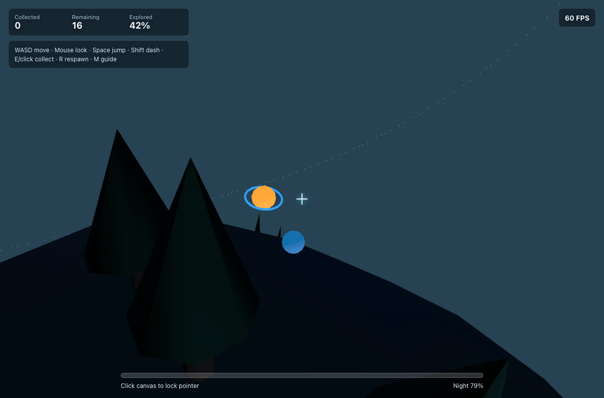

# Miniature Planet Explorer



Three.js で作った、ブラウザだけで動く小さな惑星探索アプリです。球体惑星の表面を移動しながら、発光する遺物を集めます。

公開 URL: https://sudoyan118.github.io/miniature-planet-explorer/

## 主な機能

- 小さな球体惑星の三人称探索
- 惑星中心へ向かう重力と、接平面に沿った WASD 移動
- Space ジャンプ、Shift ダッシュ、マウス視点変更
- 丘、クレーター、岩、木、草、クリスタルを procedural geometry で配置
- 16 個の収集アイテム、取得数・残数・探索率 HUD
- 中央クロスヘア、下部ステータスバー、右上 FPS 表示
- 空色、環境光、太陽光が変化する昼夜サイクル
- ウィンドウリサイズ対応

## 操作方法

| 操作 | 内容 |
| --- | --- |
| WASD | 惑星表面に沿って移動 |
| Mouse move | 視点変更 |
| Space | ジャンプ |
| Shift | ダッシュ |
| E / 左クリック | 近くのアイテムを収集 |
| R | 初期位置へリスポーン |
| M | 探索ガイド表示の切替 |
| Esc | ポインターロック解除 |

## ローカル起動

```bash
npm install
npm run dev
```

Vite の dev server は `http://127.0.0.1:5173/miniature-planet-explorer/` で起動します。

本番ビルド:

```bash
npm run build
```

## GitHub Pages と CI/CD

`.github/workflows/deploy.yml` で GitHub Pages デプロイを自動化しています。

- `main` ブランチへの push を契機に起動
- Node 20 で `npm ci` と `npm run build` を実行
- `dist` を Pages artifact として upload
- `actions/deploy-pages` で GitHub Pages に公開

Vite の `base` は `/miniature-planet-explorer/` に設定しているため、GitHub Pages のサブパス公開でも asset path が壊れません。

## QA

ローカルでは Playwright CLI で以下を確認しました。

- 初期ロードと console error なし
- WebGL canvas が表示されること
- WASD 移動、マウス視点変更、Space ジャンプ、Shift ダッシュ
- E キーによるアイテム取得と HUD 更新
- M キーのガイド表示切替、R キーのリスポーン
- QA フックで各アイテム位置へ移動し、E キーで全 16 個を取得したときの完了メッセージ
- FPS 表示更新
- 390 x 720 へのリサイズ後も canvas と HUD が崩れないこと
- 30 秒程度の exploratory pass で移動、ダッシュ、ジャンプ、視点変更、FPS 60 表示
- `npm run build` と `npm audit --audit-level=moderate`

保存した確認用スクリーンショット:

- `docs/screenshots/header-gameplay.png`
- `docs/screenshots/night-transition.png`
- `docs/screenshots/mobile-resize.png`
